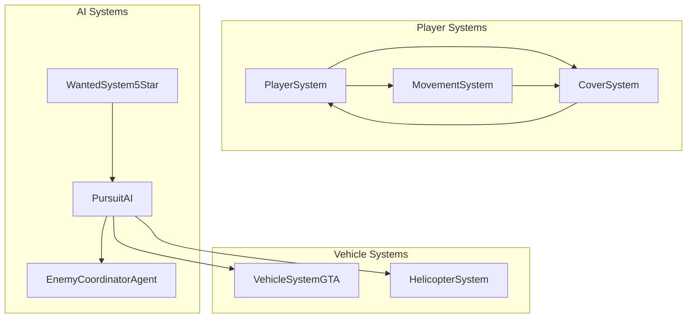

# Design Document: Enterprise 100% AAA Parity

## Overview

This design closes the final 15% gap to achieve 100% AAA enterprise-grade parity with GTA V and Modern Warfare. It implements three critical systems:

1. **Cover System** - Tactical cover mechanics with snap-to-cover, peek/blind fire, and destructible cover
2. **Advanced Movement System** - Slide, vault, and mantle mechanics for fluid traversal
3. **Vehicle Pursuit AI** - Tactical police pursuits with roadblocks, PIT maneuvers, and helicopter support

## Architecture



## Components and Interfaces

### CoverSystem

```typescript
interface CoverPoint {
  id: string;
  position: Vector3;
  normal: Vector3;           // Direction cover faces
  height: 'low' | 'high';    // Low = crouch, High = stand
  type: 'soft' | 'hard';     // Soft = 50%, Hard = 90% reduction
  destructible: boolean;
  health: number;
  maxHealth: number;
}

interface CoverState {
  inCover: boolean;
  currentCover: CoverPoint | null;
  coverSide: 'left' | 'right';
  isPeeking: boolean;
  isBlindFiring: boolean;
  transitionTarget: CoverPoint | null;
  transitionProgress: number;
}

interface CoverSystem {
  // Core operations
  enterCover(playerId: string, coverPoint: CoverPoint): boolean;
  exitCover(playerId: string): void;
  peek(playerId: string): void;
  stopPeek(playerId: string): void;
  blindFire(playerId: string): void;
  
  // Cover-to-cover movement
  findNearestCover(position: Vector3, maxDistance: number): CoverPoint | null;
  getValidTransitionTargets(from: CoverPoint, aimDirection: Vector3): CoverPoint[];
  initiateTransition(playerId: string, target: CoverPoint): boolean;
  
  // Damage handling
  calculateDamageReduction(state: CoverState, damageDirection: Vector3): number;
  damageCover(coverPoint: CoverPoint, damage: number): void;
  
  // Serialization
  serialize(): string;
  deserialize(data: string): void;
}
```

### AdvancedMovementSystem

```typescript
interface MovementState {
  isSliding: boolean;
  slideStartTime: number;
  slideVelocity: Vector3;
  isVaulting: boolean;
  vaultStartTime: number;
  vaultTarget: Obstacle | null;
  isMantling: boolean;
  mantleStartTime: number;
  mantleTarget: Obstacle | null;
}

interface Obstacle {
  id: string;
  position: Vector3;
  height: number;
  width: number;
  canVault: boolean;    // 0.5m - 1.2m
  canMantle: boolean;   // 1.2m - 2.0m
}

interface AdvancedMovementSystem {
  // Slide mechanics
  canSlide(playerId: string): boolean;
  initiateSlide(playerId: string): boolean;
  updateSlide(playerId: string, deltaTime: number): void;
  
  // Vault/Mantle mechanics
  detectObstacle(position: Vector3, direction: Vector3): Obstacle | null;
  canVault(obstacle: Obstacle): boolean;
  canMantle(obstacle: Obstacle): boolean;
  initiateVault(playerId: string, obstacle: Obstacle): boolean;
  initiateMantle(playerId: string, obstacle: Obstacle): boolean;
  
  // State queries
  getMovementState(playerId: string): MovementState;
  isVulnerable(playerId: string): boolean;
}
```

### PursuitAI

```typescript
interface PursuitVehicle {
  id: string;
  vehicleId: string;
  type: 'patrol' | 'interceptor' | 'swat' | 'helicopter';
  state: 'pursuing' | 'blocking' | 'searching' | 'pit_attempt';
  targetPlayerId: string;
  officers: string[];  // NPC IDs
}

interface Roadblock {
  id: string;
  position: Vector3;
  vehicles: string[];
  active: boolean;
}

interface PursuitState {
  activeVehicles: PursuitVehicle[];
  roadblocks: Roadblock[];
  helicopterActive: boolean;
  helicopterId: string | null;
  lastKnownPlayerPosition: Vector3;
  searchTimer: number;
  isSearching: boolean;
}

interface PursuitAI {
  // Spawn management
  spawnPursuitVehicle(wantedLevel: number, playerPosition: Vector3): PursuitVehicle;
  spawnRoadblock(playerPosition: Vector3, playerVelocity: Vector3): Roadblock;
  spawnHelicopter(playerPosition: Vector3): PursuitVehicle;
  
  // Tactical behaviors
  attemptPIT(pursuer: PursuitVehicle, targetVehicle: Vehicle): boolean;
  coordinateRoadblock(playerPosition: Vector3, playerVelocity: Vector3): void;
  updateHelicopterTracking(helicopterId: string, playerPosition: Vector3): void;
  
  // State management
  updatePursuit(deltaTime: number, playerState: PlayerState): void;
  handleLOSBreak(playerId: string): void;
  handleVehicleDisabled(playerId: string): void;
  
  // Queries
  getPursuitState(): PursuitState;
  isPlayerTracked(): boolean;
}
```

## Data Models

### Cover Point Data

```typescript
interface CoverPointData {
  id: string;
  x: number;
  y: number;
  z: number;
  normalX: number;
  normalY: number;
  normalZ: number;
  height: 'low' | 'high';
  type: 'soft' | 'hard';
  destructible: boolean;
  maxHealth: number;
}
```

### Pursuit Configuration

```typescript
interface PursuitConfig {
  level2: {
    vehicleCount: number;
    spawnRadius: number;
    vehicleTypes: string[];
  };
  level3: {
    vehicleCount: number;
    roadblockEnabled: boolean;
    roadblockDistance: number;
  };
  level4: {
    vehicleCount: number;
    helicopterEnabled: boolean;
    swatEnabled: boolean;
  };
  level5: {
    vehicleCount: number;
    militaryEnabled: boolean;
    noRetreat: boolean;
  };
  pitManeuver: {
    minDistance: number;
    maxDistance: number;
    successRate: number;
  };
  searchBehavior: {
    losBreakTime: number;
    searchDuration: number;
    searchRadius: number;
  };
}
```

## Correctness Properties

*A property is a characteristic or behavior that should hold true across all valid executions of a system-essentially, a formal statement about what the system should do. Properties serve as the bridge between human-readable specifications and machine-verifiable correctness guarantees.*

### Property 1: Cover Damage Reduction
*For any* player in cover and any incoming damage from the covered direction, the damage received SHALL be reduced by exactly the cover type's protection value (50% for soft cover, 90% for hard cover).
**Validates: Requirements 1.2**

### Property 2: Peek State Transitions
*For any* player in cover, entering peek state SHALL expose them to full damage, and exiting peek state SHALL restore cover protection.
**Validates: Requirements 1.3, 1.4**

### Property 3: Blind Fire Accuracy Penalty
*For any* weapon fired in blind fire mode from cover, the accuracy SHALL be reduced by exactly 50% compared to normal firing.
**Validates: Requirements 1.5**

### Property 4: Cover Destruction Forces Exit
*For any* destructible cover point that receives damage reducing its health to zero, the cover SHALL be destroyed and any player using it SHALL be forced to exit cover state.
**Validates: Requirements 1.6**

### Property 5: Cover Transition Damage Reduction
*For any* player transitioning between cover points, incoming damage SHALL be reduced by exactly 25% during the transition.
**Validates: Requirements 2.3**

### Property 6: Slide Velocity Conservation
*For any* player initiating a slide from sprint, the initial slide velocity SHALL be exactly 80% of sprint velocity.
**Validates: Requirements 3.2**

### Property 7: Slide Stamina Gate
*For any* player with less than 20% stamina, attempting to slide SHALL fail and the player SHALL remain in their current movement state.
**Validates: Requirements 3.5**

### Property 8: Obstacle Traversal Classification
*For any* obstacle, if height is between 0.5m and 1.2m it SHALL be classified as vaultable, if between 1.2m and 2.0m it SHALL be classified as mantleable, and if above 2.0m it SHALL be classified as impassable.
**Validates: Requirements 4.1, 4.4, 4.5**

### Property 9: Vault Vulnerability
*For any* player performing a vault or mantle action, incoming damage SHALL NOT be reduced (0% damage reduction).
**Validates: Requirements 4.3**

### Property 10: Pursuit Escalation Thresholds
*For any* wanted level change, pursuit vehicles SHALL spawn at level 2+, roadblocks SHALL spawn at level 3+, and helicopters SHALL spawn at level 4+.
**Validates: Requirements 5.1, 5.2, 6.1**

### Property 11: PIT Maneuver Distance Gate
*For any* pursuit vehicle, PIT maneuver attempts SHALL only occur when within 5 meters of the target vehicle.
**Validates: Requirements 5.3**

### Property 12: LOS Break Search Transition
*For any* pursuit where line of sight is broken for 10+ seconds, the pursuit AI SHALL transition to search pattern behavior.
**Validates: Requirements 5.5**

### Property 13: Helicopter Tracking Loss in Cover
*For any* player in a tunnel or parking structure, helicopter tracking SHALL be disabled until the player exits.
**Validates: Requirements 6.3**

### Property 14: Cover System Serialization Round-Trip
*For any* cover system state, serializing then deserializing SHALL produce an identical state with all cover points and destruction status preserved.
**Validates: Requirements 7.1, 7.2, 7.3**

## Error Handling

### Cover System Errors
- Invalid cover point: Return false from enterCover, log warning
- Cover already destroyed: Prevent entry, return false
- No valid transition target: Return empty array from getValidTransitionTargets
- Player not in cover: No-op for peek/blindFire operations

### Movement System Errors
- Insufficient stamina for slide: Return false, player remains in current state
- No valid obstacle detected: Return null from detectObstacle
- Obstacle too high: Return false from canVault/canMantle
- Already in movement action: Queue or reject new action

### Pursuit AI Errors
- No valid spawn position: Retry with expanded radius, max 3 attempts
- Roadblock position blocked: Find alternate position or skip
- Helicopter already active: Do not spawn duplicate
- Invalid vehicle state: Reset to pursuing state

## Testing Strategy

### Property-Based Testing Framework
- **Library**: fast-check (already in project)
- **Minimum iterations**: 100 per property
- **Tag format**: `// Feature: enterprise-100-percent, Property {N}: {description}`

### Unit Tests
- Cover entry/exit state transitions
- Damage calculation with various cover types
- Slide physics calculations
- Obstacle height classification
- Pursuit vehicle spawning at thresholds
- PIT maneuver distance checks

### Property-Based Tests
All 14 correctness properties will be implemented as property-based tests:

1. **Cover Damage Reduction** - Generate random damage values and cover types, verify reduction
2. **Peek State Transitions** - Generate state sequences, verify damage exposure changes
3. **Blind Fire Accuracy** - Generate weapons and fire modes, verify accuracy penalty
4. **Cover Destruction** - Generate destructible covers with damage, verify forced exit
5. **Transition Damage Reduction** - Generate transitions with damage, verify 25% reduction
6. **Slide Velocity** - Generate sprint velocities, verify 80% conservation
7. **Slide Stamina Gate** - Generate stamina values, verify slide prevention below 20%
8. **Obstacle Classification** - Generate obstacle heights, verify correct classification
9. **Vault Vulnerability** - Generate vault states with damage, verify no reduction
10. **Pursuit Escalation** - Generate wanted levels, verify correct spawns
11. **PIT Distance Gate** - Generate distances, verify PIT only within 5m
12. **LOS Break Search** - Generate LOS break durations, verify search transition
13. **Helicopter Tracking Loss** - Generate player locations, verify tracking state
14. **Serialization Round-Trip** - Generate cover states, verify serialize/deserialize identity

### Integration Tests
- Full combat scenario with cover usage
- Chase sequence with pursuit escalation
- Movement combo: sprint → slide → cover
- Save/load during pursuit
