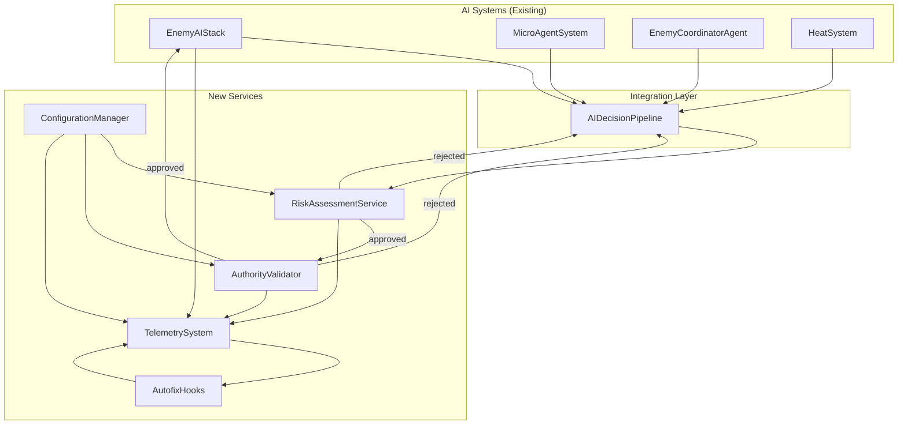

# Design Document: Risk Assessment + Authority Validator + Telemetry

## Overview

This design implements three interconnected services that wrap the existing AI systems with enterprise-grade observability, validation, and self-healing capabilities per WAR_MODE_MASTER_DIRECTIVE Section 3.

The services form a pipeline: **Assess → Validate → Execute → Log**

All AI decisions flow through this pipeline, ensuring no decision executes without risk evaluation, rule validation, and telemetry capture.

## Architecture



## Components and Interfaces

### 1. RiskAssessmentService

```typescript
interface RiskAssessment {
  decisionId: string;
  decisionType: string;
  riskScore: number;           // 0-100
  cascadingEffects: CascadingEffect[];
  approved: boolean;
  rejectionReason?: string;
  timestamp: number;
}

interface CascadingEffect {
  system: 'faction' | 'heat' | 'squad' | 'world';
  variable: string;
  predictedChange: number;
  confidence: number;
}

interface RiskAssessmentService {
  assess(decision: AIDecision): RiskAssessment;
  predictCascade(decision: AIDecision): CascadingEffect[];
  setThreshold(threshold: number): void;
  getThreshold(): number;
}
```

### 2. AuthorityValidator

```typescript
type ValidationReasonCode = 
  | 'APPROVED'
  | 'ENTITY_DEAD'
  | 'DOCTRINE_VIOLATION'
  | 'RATE_LIMITED'
  | 'INVALID_STATE'
  | 'PERMISSION_DENIED';

interface ValidationResult {
  valid: boolean;
  reasonCode: ValidationReasonCode;
  details?: string;
  entityId?: string;
  timestamp: number;
}

interface AuthorityValidator {
  validate(decision: AIDecision, gameState: GameState): ValidationResult;
  checkEntityAlive(entityId: string): boolean;
  checkDoctrineCompliance(factionId: string, action: string): boolean;
  checkRateLimit(operationType: string): boolean;
  resetRateLimits(): void;
}
```

### 3. TelemetrySystem

```typescript
interface TelemetryEvent {
  eventId: string;
  eventType: string;
  timestamp: number;
  data: Record<string, unknown>;
  latencyMs?: number;
}

interface PerformanceCounters {
  decisionsPerSecond: number;
  averageLatencyMs: number;
  memoryUsageMB: number;
  activeEntities: number;
  pendingDecisions: number;
}

interface TelemetrySystem {
  record(event: TelemetryEvent): void;
  emit(eventType: string, data: Record<string, unknown>): void;
  getCounters(): PerformanceCounters;
  enableDebugStreaming(enabled: boolean): void;
  getReasoningStream(entityId: string): NPCReasoningEntry[];
  detectAnomaly(): AnomalyReport | null;
}
```

### 4. AutofixHooks

```typescript
type AnomalyType = 
  | 'EXCESSIVE_SPAWNING'
  | 'MEMORY_THRESHOLD'
  | 'STUCK_AI'
  | 'INVALID_STATE'
  | 'PERFORMANCE_DEGRADATION';

interface AnomalyReport {
  type: AnomalyType;
  severity: 'low' | 'medium' | 'high' | 'critical';
  affectedEntities: string[];
  detectedAt: number;
  metrics: Record<string, number>;
}

interface AutofixResult {
  success: boolean;
  anomalyType: AnomalyType;
  actionTaken: string;
  entitiesAffected: number;
  escalated: boolean;
}

interface AutofixHooks {
  register(anomalyType: AnomalyType, handler: (report: AnomalyReport) => AutofixResult): void;
  trigger(report: AnomalyReport): AutofixResult;
  getRegisteredHooks(): AnomalyType[];
}
```

### 5. AIDecisionPipeline (Integration Layer)

```typescript
interface PipelineTrace {
  traceId: string;
  decision: AIDecision;
  riskAssessment: RiskAssessment;
  validation: ValidationResult;
  executed: boolean;
  executionResult?: unknown;
  totalLatencyMs: number;
  stages: PipelineStage[];
}

interface PipelineStage {
  name: string;
  startTime: number;
  endTime: number;
  result: 'pass' | 'fail' | 'skip';
}

interface AIDecisionPipeline {
  process(decision: AIDecision): PipelineTrace;
  getTrace(traceId: string): PipelineTrace | null;
  getRecentTraces(count: number): PipelineTrace[];
}
```

### 6. ConfigurationManager

```typescript
interface ServiceConfig {
  riskThreshold: number;
  rateLimits: Record<string, { maxPerSecond: number; windowMs: number }>;
  anomalyThresholds: Record<AnomalyType, number>;
  debugMode: boolean;
  telemetryEnabled: boolean;
}

interface ConfigurationManager {
  load(config: Partial<ServiceConfig>): boolean;
  get(): ServiceConfig;
  update(key: keyof ServiceConfig, value: unknown): boolean;
  validate(config: Partial<ServiceConfig>): { valid: boolean; errors: string[] };
  onChange(callback: (oldConfig: ServiceConfig, newConfig: ServiceConfig) => void): void;
}
```

## Data Models

### AIDecision

```typescript
interface AIDecision {
  id: string;
  type: 'enemy_update' | 'squad_tactic' | 'heat_change' | 'spawn' | 'despawn';
  entityId: string;
  factionId?: string;
  squadId?: string;
  action: string;
  parameters: Record<string, unknown>;
  priority: number;
  timestamp: number;
}
```

### GameState (for validation)

```typescript
interface GameState {
  entities: Map<string, EntityState>;
  factions: Map<string, FactionState>;
  squads: Map<string, SquadState>;
  worldTime: number;
  activeAnomalies: AnomalyReport[];
}

interface EntityState {
  id: string;
  alive: boolean;
  health: number;
  lastStateChange: number;
  currentState: string;
}
```

## Correctness Properties

*A property is a characteristic or behavior that should hold true across all valid executions of a system-essentially, a formal statement about what the system should do. Properties serve as the bridge between human-readable specifications and machine-verifiable correctness guarantees.*

### Property 1: Risk score bounds preservation
*For any* AI decision, the risk score calculated by RiskAssessmentService SHALL be a number between 0 and 100 inclusive.
**Validates: Requirements 1.1**

### Property 2: Risk threshold blocking
*For any* AI decision with a risk score exceeding the configured threshold, the RiskAssessmentService SHALL return approved=false with a non-empty rejectionReason.
**Validates: Requirements 1.2**

### Property 3: Cascading effect prediction completeness
*For any* AI decision that affects faction, heat, or squad systems, the RiskAssessmentService SHALL return at least one CascadingEffect in the assessment.
**Validates: Requirements 1.3**

### Property 4: Assessment logging completeness
*For any* AI decision assessed, the log entry SHALL contain timestamp, decisionType, and riskScore fields.
**Validates: Requirements 1.4**

### Property 5: Priority queue ordering
*For any* set of queued decisions, the RiskAssessmentService SHALL process them in descending priority order.
**Validates: Requirements 1.5**

### Property 6: Authority validation determinism
*For any* AI decision and game state, calling validate() twice with identical inputs SHALL produce identical ValidationResult outputs.
**Validates: Requirements 2.5**

### Property 7: Doctrine violation detection
*For any* faction with a defined doctrine and an action that violates it, the AuthorityValidator SHALL return reasonCode=DOCTRINE_VIOLATION.
**Validates: Requirements 2.3**

### Property 8: Rate limit enforcement
*For any* operation type with a configured rate limit, exceeding the limit SHALL result in reasonCode=RATE_LIMITED.
**Validates: Requirements 2.4**

### Property 9: Telemetry record completeness
*For any* executed AI decision, the TelemetrySystem SHALL record an event containing decisionType, latencyMs, and outcome.
**Validates: Requirements 3.1**

### Property 10: State change event emission
*For any* system state change (escalation, squad formation, player prediction), the TelemetrySystem SHALL emit a corresponding event.
**Validates: Requirements 3.2**

### Property 11: Anomaly-autofix trigger
*For any* detected anomaly, the TelemetrySystem SHALL invoke the registered autofix hook for that anomaly type.
**Validates: Requirements 3.3**

### Property 12: Performance counter validity
*For any* query to getCounters(), the returned PerformanceCounters SHALL have non-negative values for all numeric fields.
**Validates: Requirements 3.5**

### Property 13: Excessive spawning throttle
*For any* spawning rate exceeding 50 entities per second, the AutofixHooks SHALL throttle spawning and return success=true.
**Validates: Requirements 4.1**

### Property 14: Stuck AI reset
*For any* AI entity with no state change for 30+ seconds, the AutofixHooks SHALL reset it to idle state.
**Validates: Requirements 4.3**

### Property 15: Autofix telemetry emission
*For any* triggered autofix, the system SHALL emit a telemetry event containing fixType and affectedEntities.
**Validates: Requirements 4.4**

### Property 16: Autofix escalation on failure
*For any* autofix that fails to resolve an anomaly, the system SHALL set escalated=true and log full state.
**Validates: Requirements 4.5**

### Property 17: Pipeline risk assessment routing
*For any* call to AIDecisionPipeline.process(), the decision SHALL pass through RiskAssessmentService before execution.
**Validates: Requirements 5.1**

### Property 18: Pipeline validation routing
*For any* decision approved by RiskAssessment, the decision SHALL pass through AuthorityValidator before execution.
**Validates: Requirements 5.2**

### Property 19: Pipeline rejection propagation
*For any* decision rejected by any service, the PipelineTrace SHALL contain executed=false and the rejection reason.
**Validates: Requirements 5.4**

### Property 20: Pipeline trace completeness
*For any* completed pipeline execution, the PipelineTrace SHALL contain all stages with timing information.
**Validates: Requirements 5.5**

### Property 21: Configuration hot reload
*For any* valid configuration update, the new values SHALL take effect without system restart.
**Validates: Requirements 6.2**

### Property 22: Invalid configuration rejection
*For any* invalid configuration, the ConfigurationManager SHALL reject it and retain the previous valid configuration.
**Validates: Requirements 6.3**

### Property 23: Configuration change logging
*For any* configuration change, the system SHALL log both old and new values.
**Validates: Requirements 6.4**

## Error Handling

### Risk Assessment Errors
- Invalid decision format → Return risk score 100 (maximum risk)
- Cascade prediction failure → Log error, return empty cascading effects, continue assessment
- Threshold not configured → Use default threshold of 70

### Authority Validation Errors
- Entity not found → Return INVALID_STATE with details
- Faction not found → Return INVALID_STATE with details
- Rate limit state corruption → Reset rate limits, log error, allow operation

### Telemetry Errors
- Event recording failure → Buffer event for retry, log warning
- Counter overflow → Reset counters, emit warning event
- Debug stream overflow → Drop oldest entries, continue streaming

### Autofix Errors
- Hook not registered → Log error, return success=false, escalated=true
- Fix execution failure → Retry once, then escalate
- Multiple anomalies detected → Process in severity order (critical first)

## Testing Strategy

### Unit Tests
- Test each service in isolation with mocked dependencies
- Test edge cases: empty inputs, boundary values, null handling
- Test error paths: invalid inputs, missing config, service failures

### Property-Based Tests (fast-check)
- Use fast-check library for all 23 correctness properties
- Minimum 100 iterations per property test
- Tag each test with: `// Feature: risk-authority-telemetry, Property {number}: {property_text}`

### Integration Tests
- Test full pipeline flow: Assess → Validate → Execute → Log
- Test rejection propagation through pipeline
- Test autofix triggering from telemetry anomaly detection

### Performance Tests
- Measure pipeline latency under load (1000 decisions/second)
- Verify telemetry doesn't degrade AI performance by more than 5%
- Test memory usage with 10,000 recorded events
